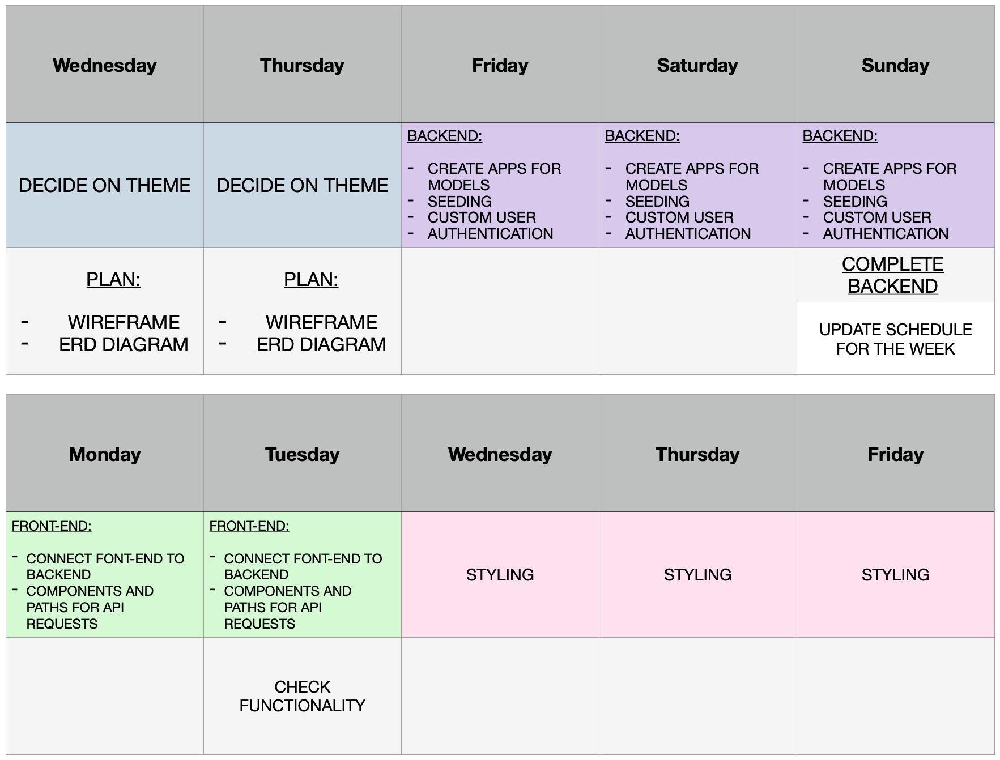
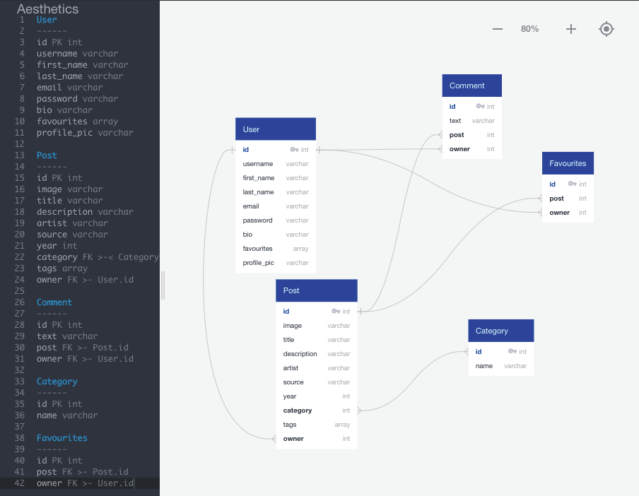
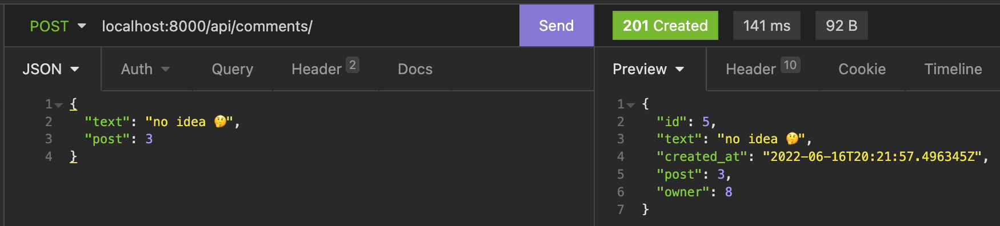

# SEI-Project-Four

* default profile picture: https://www.flaticon.com/free-icon/user_1160283?related_id=1160922&origin=search

### The Brief

To create a full-stack app (deployed online) using my own PostgreSQL database with a Python Django API and React on the front-end. The app must have multiple relationships and CRUD functionality.

Deplyement: [Link goes here]

### Overview & Concept

An online catalogue storing design aesthetics that have made their way into popular culture and consumer ephemera since the middle of the 20th century. The idea is heavily based on [Consumer Aesthetics Research Institute (CARI)](https://cari.institute/) and [Pinterest](https://www.pinterest.co.uk/).

Users can register and log in to enable them to add, delete and edit posts through a secure route. These posts can be categorised under particular aesthetics and tags. Logged in users are also able to comment on individual posts.

### Technologies Used

- PostgreSQL
- Django
- Django REST framework
- Python
- React.js
- Axios
- HTML
- CSS/Sass
- React Bootstrap
- Bootstrap
- React Masonry CSS
- PyJWT
- camelize

### Installation steps

### >> Images/GIFs of app go here

### Approach

Can go through the process methodically & chronologically - as much as I can - **but no need to make overcomplicated**.

- Created a schedule to help me keep on track. This was the first time that I had done this specifically for a project during the course and it is something I will continue moving forward.



I created a trello board to keep on track of tasks, store references, a daily diary of my porgress, and bugs/problems that I came across.

[Trello Board]

I started with my wireframe, trying to map out and specify as many features as I envisioned having - including bonus tasks that depended on completing the MVP first. I lost my wireframe midway through the project, so had to start it again.

[Wireframe]

The next step was to figure out my tables and relationships using an entity relationship diagram.



My plan involved having a many to one relationship between a User and a Post, a Comment table with a many to one relationship between Users and a Category table with a many to many relationship with Posts. My initial plan was to have an array field on the user which would hold a tuple with a user's favourite posts but I had some trouble with this - which I'll detail further down.

I then created my apps - **posts**, **comments**, **categories** and a custom user app under **jwt_auth** - each with their views, models, serializers and populated serializers, using Django and the Django REST framework. I used TablePlus to view the database and Insomnia to test requests to the *APIView* of each table.

#### Featured Code - Posts Model

The `Post` table model has a `ManyToManyField` to create a **many to many** relationship with **categories** so that posts can have more than one category and each category can have more than on post associated with it.

The model also contains a `ForeignKey` to create a **many to one relationship** with the `User` model. This is so the user who added the post to the database can be identified.

The `tags` `ArrayField` allows multiple strings to be added to each post.

```python
class Post(models.Model):
    image = models.CharField(max_length=500, default=None)
    title = models.CharField(max_length=100, default=None)
    description = models.CharField(max_length=300, default=None, blank=True) 
    artist = models.CharField(max_length=300, default=None)
    source = models.CharField(max_length=500, default=None)
    year = models.PositiveIntegerField(default=None, blank=True, null=True)
    categories = models.ManyToManyField(
        'categories.Category',
        related_name='posts'
    )
    tags = ArrayField(base_field=models.CharField(max_length=50, blank=True, default=list), size=6, blank=True, default=list)
    owner = models.ForeignKey(
        "jwt_auth.User",
        related_name="posts",
        on_delete=models.CASCADE
    )
    
    def __str__(self):
        return f"{self.title} - {self.artist} ({self.year})"
```

Below are the views for the *Post* table. I set permissions to allow any user, whether logged in or not, to access get requests only. In the post request I assign the logged in user's id to the `owner` key of the post object like this `request.data["owner"] = request.user.id`. The `owner` field is defined with a foreignKey referencing the custom auth user object as mentioned earlier.

The `PostDetailView` uses a custom function that finds a post based on its primary key. I created this so that I wouldn't have to write out the same code for each `PostDetailView` request.

For the `put` and `post` requests I utilise `is_valid()` to check if all the required fields are present and in the right format/data type.

```python
# Create your views here.
class PostListView(APIView):
    
    permission_classes = (IsAuthenticatedOrReadOnly, )
    
    # ! Endpoint: /posts/
    
    # GET
    # Description: Returns all posts
    def get(self, _request):
        posts = Post.objects.all() # get all objects from the database
        serialized_posts = PopulatedPostSerializer(posts, many=True)
        return Response(serialized_posts.data, status=status.HTTP_200_OK)
    
    # POST
    # Description: Add a new post to the database
    def post(self, request):
        request.data["owner"] = request.user.id
        # Deserialize the data
        deserialized_post = PostSerializer(data=request.data)
        try:
            # Check if has required and valid fields
            deserialized_post.is_valid(True)
            # Save the record to the database
            deserialized_post.save()
            return Response(deserialized_post.data, status.HTTP_201_CREATED)
        except ValidationError:
            return Response(deserialized_post.errors, status.HTTP_422_UNPROCESSABLE_ENTITY)
        except Exception as e:
            print("error type ->", type(e))
            print("error ->", e)
            # Return the validation error
            return Response({ 'detail': str(e) }, status.HTTP_422_UNPROCESSABLE_ENTITY)
        
class PostDetailView(APIView):
    
    # ! Endpoint: /posts/<int:pk>
    
    # ? Custom Function
    # Description: find specific post based on it's pk. If it's not there then throw an error
    def get_post(self, pk):
        try:
            return Post.objects.get(pk=pk) # Find post where its pk is the same as the pk in the request endpoint
        except Post.DoesNotExist as e:
            raise NotFound({ 'detail': str(e) })
    
    # GET
    # Description: Return one post
    def get(self, _request, pk):
        post = self.get_post(pk)
        serialized_post = PopulatedPostSerializer(post) # ! Return post data with comments & favourites included
        return Response(serialized_post.data, status.HTTP_200_OK)
    
    # PUT
    # Description: Edit one post from the posts table
    def put(self, request, pk):
        post = self.get_post(pk)
        deserialized_post = PostSerializer(post, request.data)
        try:
            deserialized_post.is_valid()
            deserialized_post.save()
            return Response(deserialized_post.data, status.HTTP_202_ACCEPTED)
        except Exception as e:
            return Response({ 'detail': str(e) }, status.HTTP_422_UNPROCESSABLE_ENTITY)
        
    # DELETE
    # Description: Delete a post from the posts table
    def delete(self, _request, pk):
        post = self.get_post(pk)
        post.delete()
        serialized_post = PostSerializer(post)
        return Response(status.HTTP_204_NO_CONTENT)
```

**Comments**

The `Comment` model below has a `post` field that references the post it is related to so that it's primary key will be saved with it. If a post is deleted I want comments referencing it to be deleted also so I utilised `on_delete= models.CASCADE` as a KWARG.

I defined an `owner` field so that the id of the user who posted it is stored in the database with it. This is also utilises a `CASCADE` relationship value.

```python
class Comment(models.Model):
    text = models.TextField(max_length=300)
    created_at = models.DateTimeField(auto_now_add=True)
    # The post that the comment is about, using the foreign key
    post = models.ForeignKey(
        'posts.Post', # Model to look for on foreign key
        related_name='comments', # The field on the 'one' in the 'one to many' relationship
        on_delete= models.CASCADE # 'CASCADE' so that comments are deleted if Post is deleted
    )
    owner = models.ForeignKey(
        "jwt_auth.User",
        related_name="comments",
        on_delete=models.CASCADE
    )
```

`owner` and `post` both reference a `comments` field on the **post** and **user** objects. I only created this on the **post** object by defining a `PopulatedSerializer` that uses the `comments` key so that comments relating to a specific post can be viewed through a request:

```python
class PopulatedPostSerializer(PostSerializer):
    # Define field to populate
    comments = PopulatedCommentSerializer(many=True)
    categories = CategorySerializer(many=True)
```

Defining the model and serializer in this way means that the request and response body looks something like this:



**Categories**

`PopulatedPostSerializer`


### Wins and Blockers

**Blockers**
- I couldn't figure out how to add strings to the `tags` `ArrayField` on the post object.
  - Through trial and error I realised I had to use base_field as a KWARG with a value of what I choose each list/array item to be - in my case, a `CharField()`. This wasn't initially clear to me from the Django documentation.

- The `Post` model contains a many to many relationship with `Category` model, however it is unlikely a post would have multiple categories, and allowing a user to do this would likely be messy- I created a `tags` field to do this. So I would like to revisit this a change the relationship to **many to one**.