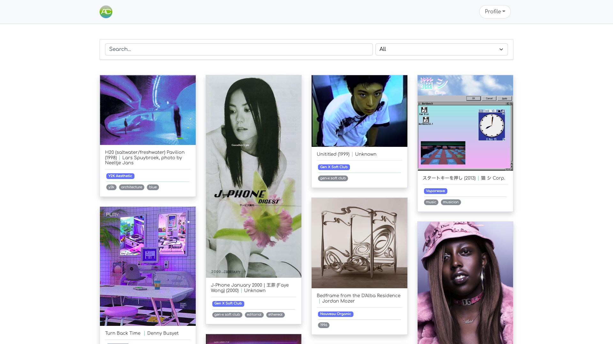
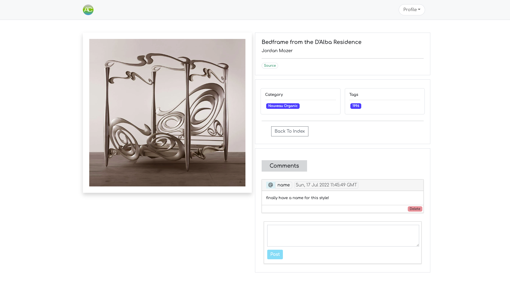
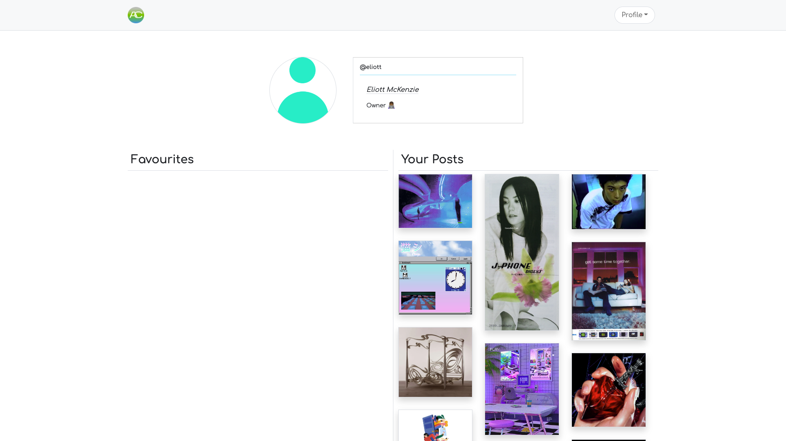
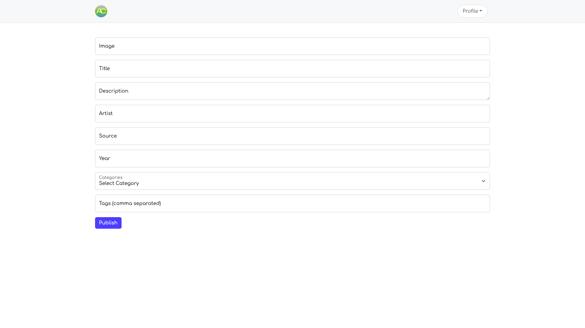
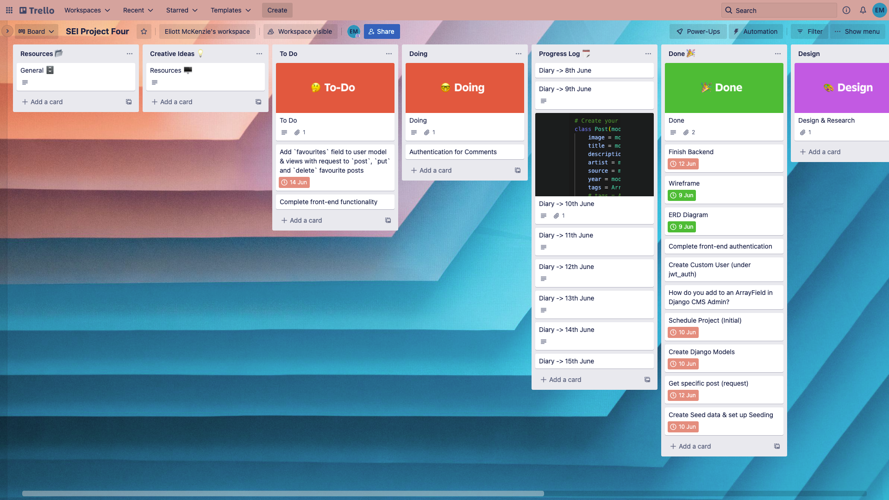
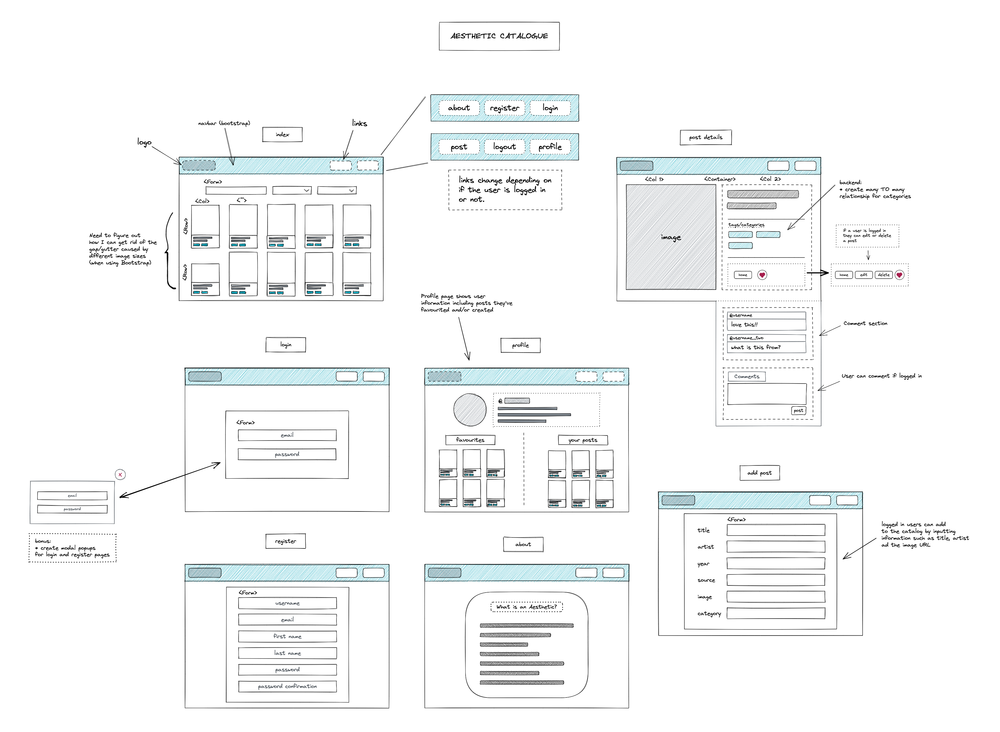

# Aesthetic Catalogue - SEI Project Four
 
### The Brief
 
#### 1.5 weeks, Solo project
 
To create a full-stack app (deployed online) using my own PostgreSQL database with a Python Django API and React on the front-end. The app must have multiple relationships and CRUD functionality.
 
Deployment: [Link goes here]
 
### Overview & Concept
 
An online catalogue storing design aesthetics that have made their way into popular culture and consumer ephemera since the middle of the 20th century. The idea is heavily based on [Consumer Aesthetics Research Institute (CARI)](https://cari.institute/) and [Pinterest](https://www.pinterest.co.uk/).
 
Users can register and log in to enable them to add, delete and edit posts through a secure route. These posts can be categorised under particular aesthetics and tags. Logged in users are also able to comment on individual posts.
 
### Technologies used
 
- PostgreSQL
- Django
- Django REST framework
- Python
- React.js
- Axios
- HTML
- CSS/Sass
- React Bootstrap
- Bootstrap
- React Masonry CSS
- PyJWT
 
### Installation steps
 
#### Homepage
 

 
#### Viewing post details
 

 
#### Profile page
 

 
#### Adding a post
 

 
### Approach
 
- Created a schedule to help me keep on track. This was the first time that I had done this specifically for a project during the course and it is something I will continue to do moving forward.
 

 
I created a trello board to keep on track of tasks, store references, a daily diary of my progress, and bugs/problems that I came across.
 

 
I started with my wireframe, trying to map out and specify as many features as I envisioned having - including bonus tasks that depended on completing the MVP first. I lost my wireframe midway through the project, so had to start it again.
 

 
The next step was to figure out my tables and relationships using an entity relationship diagram.
 

 
My plan involved having a many to one relationship between a User and a Post, a Comment table with a many to one relationship between Users and a Category table with a many to many relationship with Posts. My initial plan was to have an array field on the user which would hold a tuple with a user's favourite posts but I had some trouble with this - which I'll detail further down.
 
I then created my apps - **posts**, **comments**, **categories** and a custom user app under **jwt_auth** - each with their views, models, serializers and populated serializers, using Django and the Django REST framework. I used TablePlus to view the database and Insomnia to test requests to the _APIView_ of each table.
 
---
 
### Build process
 
#### Backend
 
I began by setting up my project with Python and using Django and Django REST Framework, creating my database using a PostgreSQL server and creating a superuser for myself.
 
The first app I started working on was for **posts**. I began defining my `Post` model. I used a `ManyToManyField` with a `related_name` of `posts` to create a **many to many** relationship with **categories**. This was so that posts can have more than one category and each category can have more than one post associated with it. I also added a `ForeignKey` to create a **many to one relationship** with the `User` model, so that each user who adds a post to the database can be identified. I also defined a `tags` `ArrayField` to try and allow multiple strings - tags - to be added to each post. From then and throughout the project I was able to build my database using Django's CMS.
 
I then realised that I should have created a custom user rather than the default user, and before starting anything else. As a result I had to dump and reload the data from the posts app, alter some migrations and drop and recreate my database.
 
After sorting this out I defined my first view - a `get` request to retrieve `Post` data from the database.
 
When using both the CMS and my newly created request, I had trouble figuring out how to add multiple tags to a post. With my request it would throw an error saying that the `tags` (ArrayField) didn't exist and therefore could not be read. Using the CMS, I tried adding commas between each tag but I had no way of checking it registered as an array until I was able to serialize the request data.
 
The Django documentation was quite vague so I had to play around with different ways of defining the `tags` field. I eventually realised I had to use `base_field` as a KWARG with a value of what I choose each list/array item to be -- in my case, a `CharField()`.
 
```python
ArrayField(base_field=models.CharField(max_length=50), size=6, blank=True)
```
 
I wanted users of my app to be able to comment on any post so next, I worked on the **comments** app, defined the `comments` model and its serializer. I then added a _post_ request to my **posts** app and added `null=True` to some of the fields so that they would not be required.
 
I then moved on to the **categories** app and defining the `Category` model which I wanted to have a Many To Many relationship with the `Post` model. This was done by referencing the **Category** model on the **Post** model by using a `ManyToMany` field.
 
The next step was to finish defining all of the requests, serializers and authentication rules for each app - categories, comments & posts. To finish up the backend I added custom authentication to the custom user app `jwt_auth` using `pyjwt`.
 
---
 
#### Featured Code - Posts Model
 
```python
class Post(models.Model):
   image = models.CharField(max_length=500, default=None)
   title = models.CharField(max_length=100, default=None)
   description = models.CharField(max_length=300, default=None, blank=True)
   artist = models.CharField(max_length=300, default=None)
   source = models.CharField(max_length=500, default=None)
   year = models.PositiveIntegerField(default=None, blank=True, null=True)
   categories = models.ManyToManyField(
       'categories.Category',
       related_name='posts'
   )
   tags = ArrayField(base_field=models.CharField(max_length=50, blank=True, default=list), size=6, blank=True, default=list)
   owner = models.ForeignKey(
       "jwt_auth.User",
       related_name="posts",
       on_delete=models.CASCADE
   )
 
   def __str__(self):
       return f"{self.title} - {self.artist} ({self.year})"
```
 
Below are the views for the _Post_ table. I set permissions to allow any user, whether logged in or not, to access get requests only. In the post request I assign the logged in user's id to the `owner` key of the post object like this `request.data["owner"] = request.user.id`. The `owner` field is defined with a foreignKey referencing the custom auth user object as mentioned earlier.
 
The `PostDetailView` uses a custom function that finds a post based on its primary key. I created this so that I wouldn't have to write out the same code for each `PostDetailView` request.
 
For the `put` and `post` requests I utilised `is_valid()` to check if all the required fields are present and in the right format/data type.
 
```python
# Create your views here.
class PostListView(APIView):
 
   permission_classes = (IsAuthenticatedOrReadOnly, )
 
   # ! Endpoint: /posts/
 
   # GET
   # Description: Returns all posts
   def get(self, _request):
       posts = Post.objects.all() # get all objects from the database
       serialized_posts = PopulatedPostSerializer(posts, many=True)
       return Response(serialized_posts.data, status=status.HTTP_200_OK)
 
   # POST
   # Description: Add a new post to the database
   def post(self, request):
       request.data["owner"] = request.user.id
       # Deserialize the data
       deserialized_post = PostSerializer(data=request.data)
       try:
           # Check if has required and valid fields
           deserialized_post.is_valid(True)
           # Save the record to the database
           deserialized_post.save()
           return Response(deserialized_post.data, status.HTTP_201_CREATED)
       except ValidationError:
           return Response(deserialized_post.errors, status.HTTP_422_UNPROCESSABLE_ENTITY)
       except Exception as e:
           print("error type ->", type(e))
           print("error ->", e)
           # Return the validation error
           return Response({ 'detail': str(e) }, status.HTTP_422_UNPROCESSABLE_ENTITY)
 
class PostDetailView(APIView):
 
   # ! Endpoint: /posts/<int:pk>
 
   # ? Custom Function
   # Description: find specific post based on it's pk. If it's not there then throw an error
   def get_post(self, pk):
       try:
           return Post.objects.get(pk=pk) # Find post where its pk is the same as the pk in the request endpoint
       except Post.DoesNotExist as e:
           raise NotFound({ 'detail': str(e) })
 
   # GET
   # Description: Return one post
   def get(self, _request, pk):
       post = self.get_post(pk)
       serialized_post = PopulatedPostSerializer(post) # ! Return post data with comments & favourites included
       return Response(serialized_post.data, status.HTTP_200_OK)
 
   # PUT
   # Description: Edit one post from the posts table
   def put(self, request, pk):
       post = self.get_post(pk)
       deserialized_post = PostSerializer(post, request.data)
       try:
           deserialized_post.is_valid()
           deserialized_post.save()
           return Response(deserialized_post.data, status.HTTP_202_ACCEPTED)
       except Exception as e:
           return Response({ 'detail': str(e) }, status.HTTP_422_UNPROCESSABLE_ENTITY)
 
   # DELETE
   # Description: Delete a post from the posts table
   def delete(self, _request, pk):
       post = self.get_post(pk)
       post.delete()
       serialized_post = PostSerializer(post)
       return Response(status.HTTP_204_NO_CONTENT)
```
 
**Comments**
 
The `Comment` model below has a `post` field that references the post it is related to so that its primary key will be saved with it. If a post is deleted I want comments referencing it to be deleted also so I used `on_delete= models.CASCADE` as a KWARG.
 
I defined an `owner` field so that the id of the user who posted it is stored in the database with it. This also utilises a `CASCADE` relationship value.
 
```python
class Comment(models.Model):
   text = models.TextField(max_length=300)
   created_at = models.DateTimeField(auto_now_add=True)
   # The post that the comment is about, using the foreign key
   post = models.ForeignKey(
       'posts.Post', # Model to look for on foreign key
       related_name='comments', # The field on the 'one' in the 'one to many' relationship
       on_delete= models.CASCADE # 'CASCADE' so that comments are deleted if Post is deleted
   )
   owner = models.ForeignKey(
       "jwt_auth.User",
       related_name="comments",
       on_delete=models.CASCADE
   )
```
 
`owner` and `post` both reference a `comments` field on the **post** and **user** objects. I only created this on the **post** object by defining a `PopulatedSerializer` that uses the `comments` key so that comments relating to a specific post can be viewed through a request:
 
```python
class PopulatedPostSerializer(PostSerializer):
   # Define field to populate
   comments = PopulatedCommentSerializer(many=True)
   categories = CategorySerializer(many=True)
```
 
Defining the model and serializer in this way means that the request and response body looks something like this:
 

 
---
 
#### Frontend
 
I started by creating the post index and post detail components which use an axios get request that I then took the JSON keys from to get values such as artist name and image url.
 
Because I wanted a way to display an individual post's details, in the post index JSX I included a `Link` component from `react-router-dom` around each post pointing to a path ending in that post's unique ID (generated by MongoDB). In the post details component I could then import `useParams` (also from `react-router-dom`) to append this ID to a get request to my `PostDetailView`(link this) endpoint.
 
As my backend was built in Python which uses snake case I had to try and find a way to convert this to camel case (as used in JavaScript and React). I managed to find and install a package called [camelize](https://www.npmjs.com/package/camelize) which made it very easy to convert the keys in the data from my requests.
 
```jsx
useEffect(() => {
 const getPost = async () => {
   try {
     const { data } = await axios.get(`/api/posts/${id}/`);
     // convert data keys to camel case
     const camelData = camelize(data);
     // set the data to state
     setPost(camelData);
   } catch (error) {
     console.log("error ->", error);
   }
 };
 getPost();
}, [id, checkComment]);
```
 
To check if the logged in user is the owner of the post I invoke a function that tests the `payload` against the `post.owner` value from the data returned. If they are, then in the JSX I use ternaries to display the 'Edit' and 'Delete' buttons. These buttons are attached to a put and delete request:
 
```jsx
{
 userIsOwner() ? (
   <Container>
     <ButtonGroup>
       <Button
         className="m-1"
         variant="primary"
         as={Link}
         to={`/posts/${id}/edit`}
       >
         Edit
       </Button>
       <Button className="m-1" variant="secondary" onClick={handleDelete}>
         Delete
       </Button>
     </ButtonGroup>
     <Button
       className="m-1 rounded-0 ms-4 bg-white btn-outline-secondary"
       as={Link}
       to={"/"}
     >
       Back To Index
     </Button>
   </Container>
 ) : (
   <>
     <Container>
       <ButtonGroup>
         <Button
           className="m-1 rounded-0 ms-4 bg-white btn-outline-secondary"
           as={Link}
           to={"/"}
         >
           Back To Index
         </Button>
       </ButtonGroup>
     </Container>
   </>
 );
}
```
 
I wanted users to add or delete their comments from a post in the database so using a React Bootstrap form component I created a function to submit a post request. I wanted the user to only be able to delete comments they made so I used a function to get the payload so that I could check if the logged in user is the owner of a particular comment. Through ternary control flow I made it so that the 'delete' button only shows if it returns `true`.
 
Because I used a Bootstrap component, I had to use an arrow function for the `eventListener with the comment id passed in instead of destructuring it directly from the data.
 
```jsx
{
 getPayload() && (
   <>
     {getPayload().sub === owner.id ? (
       <Card.Footer className="p-1 bg-white">
         <Badge
           onClick={() => handleCommentDelete(id)}
           className="delete-comment bg-danger text-muted border-0 bg-opacity-50 float-end"
         >
           Delete
         </Badge>
       </Card.Footer>
     ) : (
       <></>
     )}
   </>
 );
}
```
 
The function:
 
```jsx
const handleCommentDelete = async (commentId) => {
   setCheckComment(false)
 
   try {
     const { data } = await axios.delete(`/api/comments/${commentId}/`, {
       headers: {
         Authorization: `Bearer ${getTokenFromLocalStorage()}`,
       },
     })
     setCheckComment(true)
   } catch (error) {
     console.log('error ->', error.response)
   }
 }
```
 
I styled almost everything with React Bootstrap components and Bootstrap as it makes it easy to style and structure things, and the use of columns and rows gives you a good level of responsiveness.
 
---
 
### Wins and Blockers
 
**Blockers**
 
- I couldn't figure out how to add strings to the `tags` `ArrayField` on the post object.
 
 - Through trial and error I realised I had to use base_field as a KWARG with a value of what I choose each list/array item to be - in my case, a `CharField()`. This wasn't initially clear to me from the Django documentation.
 
- The `Post` model contains a many to many relationship with the `Category` model, however it is unlikely that a post would have multiple categories, and allowing a user to do this would likely be messy- I created a `tags` field to do this. So I would like to revisit this a change the relationship to **many to one**.
 
- I had trouble understanding relationships in SQL and the process of using serializers and populated serializers. This became more apparent when I tried to implement a ‘favourites’ feature for the user. I would like to create another Python DJango API so that I can go over this again
 
**Wins**
 
- Allowing CRUD functionality
- Creating comment functionality - users can comment on posts or delete their own comment (through the use of a token)
 
---
 
**Key learnings**
 
I should have asked for help earlier on rather than trying to work it out on my own (and getting stressed). Even if I look back knowing I couldn’t work out everything myself, I’m still able to learn something that I can use going forward (and not need help then)
The general workings of a Django API - I struggled in the beginning to understand the structure
 
### Future features
 
- Make the dropdown filter functional
- Add a favourites feature to allow users to add posts they like to their profile
- Improve the styling
- Improve the way the app responds to different screen sizes
 
### Assets
 
- [Default profile picture](https://www.flaticon.com/free-icon/user_1160283?related_id=1160922&origin=search)
 
- Logo: [Me](https://eliottmckenzie.com)